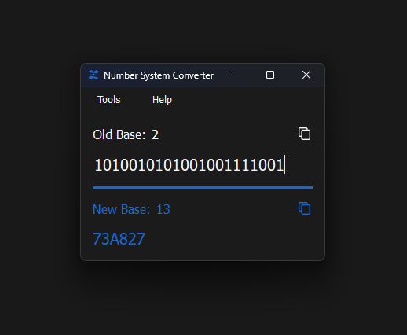

# Number System Converter

## Overview

Number System Converter is a lightweight desktop application designed to convert numbers between multiple numeral systems with a minimal and intuitive interface.

## Preview

> [!NOTE]
> The application is under development. 
> You can download the latest non-release build for Windows10/11 [here](https://github.com/BIBlical33/number-system-converter/releases/tag/v0.1.1-rc).